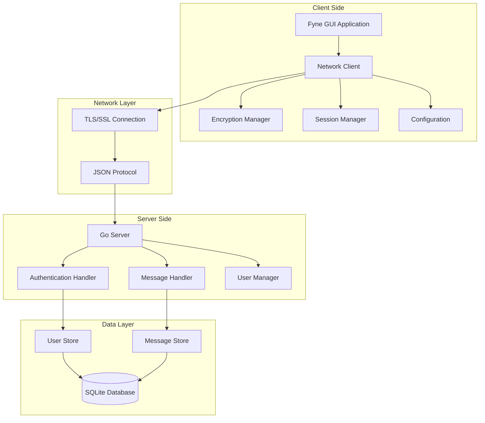
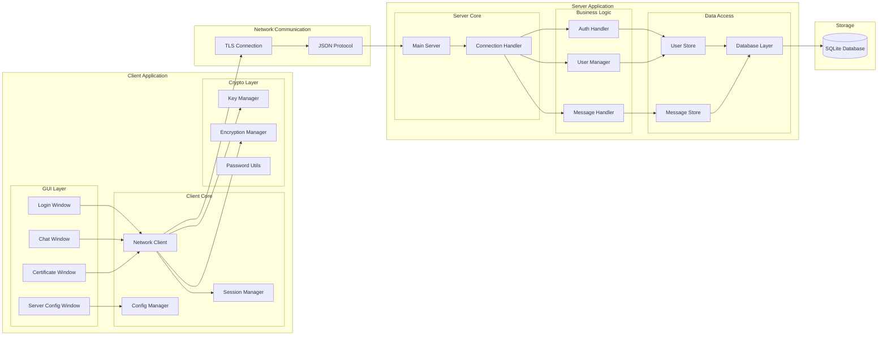
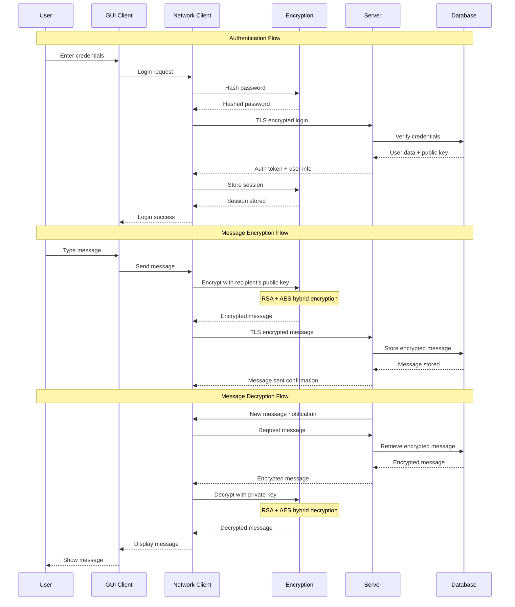

# Secure Messenger

A secure, end-to-end encrypted messaging application built with Go, featuring a modern GUI and robust security measures.

## 🔐 Security Features

- **End-to-End Encryption**: AES-256-GCM encryption for message content
- **Key Exchange**: RSA-2048 for secure key distribution
- **Password Security**: PBKDF2 with SHA-256 and random salt (100,000 iterations)
- **TLS Communication**: All network traffic encrypted with TLS 1.3
- **Session Management**: Secure session tokens with automatic expiration
- **Certificate Verification**: Proper TLS certificate validation
- **Secure Storage**: Local credentials and keys stored with appropriate permissions

## ✨ Features

- **User Authentication**: Secure registration and login with password hashing
- **Direct Messaging**: One-on-one encrypted conversations
- **Channel Support**: Group conversations with multiple participants
- **Persistent Storage**: SQLite database for message history and user data
- **Cross-Platform**: Native GUI that runs on Windows, Linux, and macOS
- **Modern Interface**: Built with Fyne for a native look and feel
- **Server Configuration**: Easy server discovery and connection management
- **Certificate Management**: Secure TLS connection with certificate verification
- **Session Persistence**: Automatic login with secure session storage
how 
## 🏗️ Architecture

### Project Structure
```
secure-messenger/
├── bin/                    # Compiled binaries
├── client/                 # Client core logic
│   ├── config.go          # Configuration management
│   ├── message_handler.go # Local message handling
│   ├── network_client.go  # Network communication
│   └── session_manager.go # Session management
├── client_gui/            # GUI application
│   ├── main.go           # Application entry point
│   ├── login_window.go   # Login/registration UI
│   ├── chat_window.go    # Main chat interface
│   ├── server_config_window.go # Server configuration
│   └── certificate_window.go   # Certificate management
├── crypto/                # Cryptographic functions
│   ├── encryption.go     # Message encryption/decryption
│   ├── key_manager.go    # RSA key management
│   └── password_utils.go # Password hashing utilities
├── server/                # Server implementation
│   ├── main.go           # Server entry point
│   ├── auth.go           # Authentication logic
│   ├── message_handler.go # Message processing
│   └── user_manager.go   # User and connection management
├── storage/               # Database layer
│   ├── database.go       # Database initialization
│   ├── message_store.go  # Message persistence
│   └── user_store.go     # User data persistence
├── shared/                # Shared types and protocol
│   └── protocol.go       # Network protocol implementation
├── go.mod                 # Go module definition
├── Makefile              # Build automation
└── setup.sh              # Development setup script
```

### Technology Stack

- **Backend**: Go 1.21+
- **Database**: SQLite3
- **GUI Framework**: Fyne v2.4.3
- **Cryptography**: 
  - AES-256-GCM for message encryption
  - RSA-2048 for key exchange
  - PBKDF2-SHA256 for password hashing
  - TLS 1.3 for transport security
- **Dependencies**:
  - `golang.org/x/crypto` - Cryptographic functions
  - `github.com/mattn/go-sqlite3` - SQLite driver
  - `github.com/google/uuid` - UUID generation
  - `github.com/boltdb/bolt` - Key-value storage

## 🚀 Quick Start

### Prerequisites

- Go 1.21 or later
- OpenSSL (for certificate generation)
- Git

### 1. Clone and Setup

```bash
git clone https://github.com/raproid/go-messenger.git
cd secure-messenger
```

### 2. Install Dependencies

```bash
make deps
```

### 3. Generate Certificates

```bash
make certs
```

This creates:
- `certs/server.crt` - Server certificate
- `certs/server.key` - Server private key

### 4. Build Application

```bash
# Build all components
make build

# Or build individually
make build-server
make build-client
```

### 5. Run Application

```bash
# Terminal 1: Start server
make run-server

# Terminal 2: Start client
make run-client
```

## 🔧 Configuration

### Server Configuration

The server runs on port 8080 by default with TLS enabled. To configure:

1. Edit `client/config.go` to change server address
2. Place server certificate in the appropriate location
3. Update client configuration if needed

### Client Configuration

The client stores configuration in `config.json` (project root):

```json
{
  "server_address": "server",
  "server_port": 8080,
  "use_tls": true,
  "server_name": "server",
  "cert_path": "certs/server.crt"
}
```

## Architecture

### High-level System Architecture


### Detailed Component Architecture


### Security & Data Flow Architecture


## 🛠️ Development

### Available Make Commands

```bash
# Build Commands
make build          # Build all binaries
make build-server   # Build server only
make build-client   # Build client only
make build-all      # Build for all platforms

# Run Commands
make run-server     # Run server
make run-client     # Run client
make run            # Run both

# Development Commands
make test           # Run tests
make test-coverage  # Run tests with coverage
make lint           # Run linter
make fmt            # Format code
make security       # Run security scan

# Setup Commands
make certs          # Generate TLS certificates
make data-dir       # Create data directory
make dev-setup      # Complete development setup
make prod-setup     # Complete production setup

# Clean Commands
make clean          # Clean build artifacts
make clean-deps     # Clean dependencies
```

### Running Tests

```bash
# Run all tests
make test

# Run tests with coverage
make test-coverage

# Run security scan
make security
```

### Code Quality

```bash
# Format code
make fmt

# Run linter
make lint

# Install development tools
make install-tools
```

## 🔒 Security Considerations

### Encryption Details

1. **Message Encryption**:
   - Each message is encrypted with a unique AES-256-GCM key
   - The AES key is encrypted with the recipient's RSA public key
   - Nonce is generated for each encryption operation

2. **Password Security**:
   - Passwords are hashed using PBKDF2-SHA256
   - 100,000 iterations for key derivation
   - Random 32-byte salt per password

3. **Key Management**:
   - RSA-2048 key pairs for each user
   - Private keys stored securely on client
   - Public keys exchanged through server

4. **Transport Security**:
   - All communication encrypted with TLS 1.3
   - Server certificate verification
   - Perfect Forward Secrecy

### Best Practices

- Never share private keys
- Use strong, unique passwords
- Keep certificates secure
- Regularly update dependencies
- Monitor for security advisories

## 📱 Usage

### First Time Setup

1. **Start the server** on your VDS or local machine
2. **Configure the client** with server details
3. **Import server certificate** for TLS verification
   - **Development Note**: The client is configured to accept self-signed certificates for development (`InsecureSkipVerify: true`)
4. **Register a new account** or login with existing credentials

### Sending Messages

1. **Direct Messages**: Select a user from the contact list
2. **Channel Messages**: Join or create a channel
3. **Type your message** and press Send
4. **Messages are automatically encrypted** before transmission

### Managing Channels

1. **Create Channel**: Click "New Channel" and add members
2. **Join Channel**: Enter channel ID or get invited
3. **Leave Channel**: Remove yourself from unwanted channels

## 🐳 Docker Support

```bash
# Build Docker image
make docker-build

# Run Docker container
make docker-run
```

## 📋 API Reference

### Authentication Endpoints

- `POST /register` - User registration
- `POST /login` - User login
- `POST /logout` - User logout

### Message Endpoints

- `POST /send_message` - Send direct message
- `POST /send_channel_message` - Send channel message
- `GET /get_messages` - Retrieve message history
- `GET /get_channel_messages` - Retrieve channel messages

### Channel Endpoints

- `POST /create_channel` - Create new channel
- `GET /get_user_channels` - Get user's channels
- `POST /add_user_to_channel` - Add user to channel
- `POST /remove_user_from_channel` - Remove user from channel

## 🤝 Contributing

1. Fork the repository
2. Create a feature branch (`git checkout -b feature/amazing-feature`)
3. Commit your changes (`git commit -m 'Add amazing feature'`)
4. Push to the branch (`git push origin feature/amazing-feature`)
5. Open a Pull Request

### Development Guidelines

- Follow Go best practices and conventions
- Write tests for new features
- Update documentation as needed
- Ensure security considerations are addressed
- Use meaningful commit messages

## 📄 License

This project is licensed under the MIT License - see the [LICENSE](LICENSE) file for details.

## 🆘 Troubleshooting

### Common Issues

1. **Connection Failed**:
   - Check server address and port
   - Verify TLS certificate is correct
   - Ensure server is running

2. **Authentication Failed**:
   - Verify username and password
   - Check if account exists
   - Clear session and try again

3. **Certificate Errors**:
   - Ensure certificate is valid
   - Check certificate path in config
   - Regenerate certificates if needed

4. **Build Errors**:
   - Ensure Go 1.21+ is installed
   - Run `go mod tidy`
   - Check all dependencies are available

### Getting Help

- Check the [Issues](https://github.com/your-repo/issues) page
- Review the troubleshooting section
- Create a new issue with detailed information

## 🔮 Roadmap

- [ ] Voice and video calling
- [ ] File sharing with encryption
- [ ] Message reactions and threading
- [ ] Mobile applications
- [ ] Advanced security features
- [ ] Plugin system
- [ ] Message search and filtering
- [ ] Custom themes and UI customization

## 🙏 Acknowledgments

- [Fyne](https://fyne.io/) for the excellent GUI framework
- [Go Crypto](https://golang.org/x/crypto) for cryptographic functions
- [SQLite](https://sqlite.org/) for reliable data storage
- The Go community for excellent libraries and tools

---

**⚠️ Security Notice**: This is a personal project for educational purposes. While it implements strong security measures, it should not be used for production environments without thorough security auditing and testing.